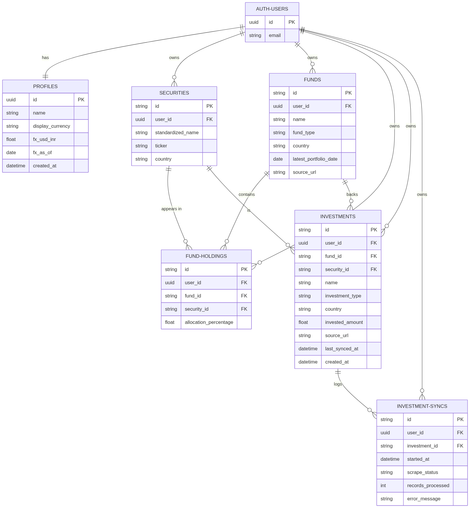
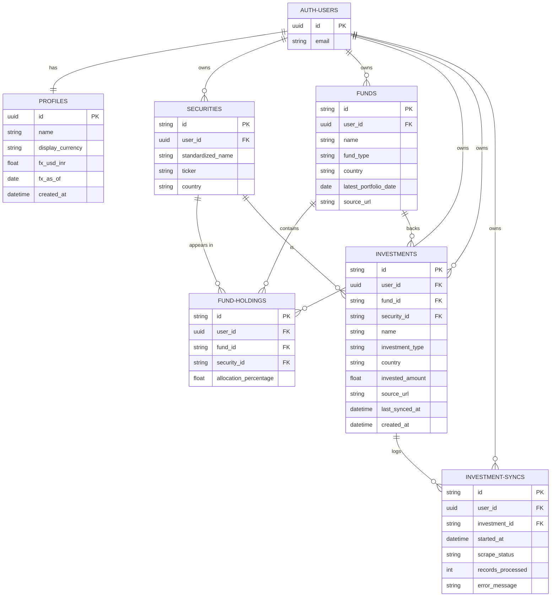

# Vestalyze data model

This is the current Supabase schema: six public tables plus `auth.users` (managed by Supabase Auth). The source of truth is [`supabase/schema.sql`](../supabase/schema.sql). Setup and RLS live in [SUPABASE.md](./SUPABASE.md).

Every public row is owned by one account. Look-through math is not stored: the API loads investments + holdings and computes exposure in `src/lib/finance`.

```text
effective_exposure = invested_amount × (allocation_percentage / 100)
```

The same company is then summed across mutual funds, ETFs, and direct stocks.

---

## Entity-relationship diagram



This is a rendered image, not a live Mermaid block, so it always displays the same way regardless of your editor's Mermaid support.

In the diagram, `PROFILES.id` is also the FK to `AUTH-USERS`. Columns named `type` in SQL are shown as `fund_type` and `investment_type` because Mermaid treats `type` as a reserved word. Use the field tables below for the exact Postgres names.

<details>
<summary>Mermaid source (used to regenerate the image above)</summary>



To regenerate `images/er-diagram.png` after a schema change, run (no local install needed — it calls the public [mermaid.ink](https://mermaid.ink) renderer):

```bash
B64=$(python3 -c "import base64,sys; print(base64.urlsafe_b64encode(open('/dev/stdin','rb').read()).decode())" < path/to/diagram.mmd)
curl -sL "https://mermaid.ink/img/${B64}?type=png&width=1600&bgColor=white" -o docs/images/er-diagram.png
```

Save the Mermaid block above to `path/to/diagram.mmd` first (without the surrounding ` ```mermaid ` fences).

</details>

`auth.users` is not a public table. Email and password live there. Vestalyze never stores a password hash in `public`.

---

## How the pieces fit

| You add…                 | What gets written                                                                                                          |
| ------------------------ | -------------------------------------------------------------------------------------------------------------------------- |
| A **direct stock**       | One `investments` row (`type = stock`) and one `securities` row. `security_id` points at that company. `fund_id` is empty. |
| A **mutual fund or ETF** | One `investments` row and one `funds` row (reused if you already used the same fund URL). `fund_id` is set.                |
| **Sync holdings**        | New `securities` for each company name, `fund_holdings` rows (weight %), and an `investment_syncs` history row.            |

Deleting the account calls `delete_own_account()`: syncs → holdings → investments → funds → securities → profile → `auth.users`. Other accounts are not touched.

---

## Enums

| Type              | Values                         | Why                                                                                   |
| ----------------- | ------------------------------ | ------------------------------------------------------------------------------------- |
| `country_code`    | `IN`, `US`                     | Markets the product supports. Drives India vs US views and which currency a row uses. |
| `currency_code`   | `INR`, `USD`                   | Only used by `profiles.display_currency`. Position currency is derived from country.  |
| `investment_type` | `mutual_fund`, `etf`, `stock`  | What the user bought. Stocks do not sync a fund URL.                                  |
| `fund_type`       | `mutual_fund`, `etf`           | Same as investment type minus stock. A fund catalog row is never a direct stock.      |
| `scrape_status`   | `success`, `failed`, `running` | One sync attempt on the investment detail page.                                       |

---

## `auth.users` (Supabase Auth)

Login identity. Created by `signUp`. The app reads `id` and `email` only.

| Field                   | Purpose                                                                             |
| ----------------------- | ----------------------------------------------------------------------------------- |
| `id`                    | Owner key for every public table. `profiles.id` is this value.                      |
| `email`                 | Sign-in address. Shown and edited in Settings. Not duplicated on `profiles`.        |
| password (Auth-managed) | Hashed by Supabase. Used to sign in, change password, and confirm account deletion. |

---

## `profiles`

One row per account. Settings, sidebar name, display currency, and the USD/INR rate used to combine India and US totals.

Inserted by the `handle_new_user` trigger on signup. The user can update name and FX later. There is no insert policy for `authenticated`; only the trigger (and account delete) write this row.

| Field              | Type                     | Purpose                                                                                             |
| ------------------ | ------------------------ | --------------------------------------------------------------------------------------------------- |
| `id`               | `uuid` PK → `auth.users` | Same id as the Auth user. One profile per login. Cascade-deleted with the Auth user.                |
| `name`             | `text` (1–80)            | Display name (sidebar, Settings, onboarding). Comes from signup metadata, then Edit profile.        |
| `display_currency` | `INR` \| `USD`           | How consolidated amounts are shown. Native lots stay in their own currency; totals convert with FX. |
| `fx_usd_inr`       | `numeric` > 0            | Manual USD per INR. Default `87.25`. Used for India vs US and portfolio totals.                     |
| `fx_as_of`         | `date`                   | Day the rate was last saved. Shown as “Last set …” in Settings.                                     |
| `created_at`       | `timestamptz`            | When the profile row was created (signup).                                                          |

---

## `securities`

Per-user company master. Direct stocks the user enters and companies scraped from a fund book both land here. Unique on `(user_id, ticker, country)` so two accounts can own `AAPL` / `US` without colliding, and the same ticker in India vs US stays two rows.

| Field               | Type                  | Purpose                                                                                                                                                            |
| ------------------- | --------------------- | ------------------------------------------------------------------------------------------------------------------------------------------------------------------ |
| `id`                | `text` PK             | Stable id (`sec-…`). Built from user + ticker + country so a later sync can find the same company.                                                                 |
| `user_id`           | `uuid` → `auth.users` | Tenant. RLS: only the owner reads or writes.                                                                                                                       |
| `standardized_name` | `text`                | Label in exposure tables and company drill-down (“HDFC Bank”, “Apple”).                                                                                            |
| `ticker`            | `text`                | Dedup key. For a typed stock this is the stock code (`HDFCBANK`). For a scraped holding it is a slug from the company name. Not shown as a column on most screens. |
| `country`           | `IN` \| `US`          | Which market book this name belongs to. Part of uniqueness, and the input to the derived currency.                                                                 |

Category / sector is not stored. Weight and market split come from investments + holdings, not from a sector field. Currency is not stored either: it is `IN → INR`, `US → USD`, derived in `currencyForCountry`.

---

## `funds`

A mutual fund or ETF **source** for this user: name, market, and the public URL used to scrape the stock split. Two investments that share the same URL reuse one fund and therefore the same holdings.

| Field                   | Type                   | Purpose                                                                                                                         |
| ----------------------- | ---------------------- | ------------------------------------------------------------------------------------------------------------------------------- |
| `id`                    | `text` PK              | `fund-` + uuid. Pointed to by `investments.fund_id` and `fund_holdings.fund_id`.                                                |
| `user_id`               | `uuid` → `auth.users`  | Tenant.                                                                                                                         |
| `name`                  | `text`                 | Fund or ETF name (usually copied from the investment).                                                                          |
| `type`                  | `mutual_fund` \| `etf` | Product kind. Never `stock`.                                                                                                    |
| `country`               | `IN` \| `US`           | Market of the product. Also the input to the derived currency.                                                                  |
| `latest_portfolio_date` | `date`                 | As-of date from the last successful scrape (holding date on the page). Shown next to “Underlying holdings”.                     |
| `source_url`            | `text`                 | Public factsheet / INDmoney URL. Unique per user when non-empty so a second investment with the same URL attaches to this fund. |

---

## `fund_holdings`

The look-through book: each row is “this fund has X% in that company.” Sync deletes the previous rows for that fund and inserts a fresh set, so this is always the latest snapshot and never a history. The as-of date lives once on `funds.latest_portfolio_date` rather than being repeated on every holding.

| Field                   | Type                  | Purpose                                                                                                                     |
| ----------------------- | --------------------- | --------------------------------------------------------------------------------------------------------------------------- |
| `id`                    | `text` PK             | `hold-` + uuid.                                                                                                             |
| `user_id`               | `uuid` → `auth.users` | Tenant (same owner as the fund). Lets RLS filter without joining.                                                           |
| `fund_id`               | `text` → `funds`      | Which product this weight belongs to. Cascade-deleted with the fund.                                                        |
| `security_id`           | `text` → `securities` | Which company. Combined across funds on the exposure pages.                                                                 |
| `allocation_percentage` | `numeric(8,4)` 0–100  | Weight in the fund. `invested_amount × weight / 100` is the user’s rupee/dollar exposure to that name through this product. |

Unique on `(fund_id, security_id)`: one company appears at most once per fund.

---

## `investments`

A lot the user actually holds: how much they put in, what kind of product, and (for funds) which URL to sync. This is the amount side of look-through. Units are not stored; amount + holding % is enough.

| Field             | Type                              | Purpose                                                                                                               |
| ----------------- | --------------------------------- | --------------------------------------------------------------------------------------------------------------------- |
| `id`              | `text` PK                         | Default `gen_random_uuid()`. Used in `/investments/:id` and in sync history.                                          |
| `user_id`         | `uuid` → `auth.users`             | Tenant.                                                                                                               |
| `fund_id`         | `text` → `funds`, nullable        | Set for mutual funds and ETFs. Empty for a direct stock.                                                              |
| `security_id`     | `text` → `securities`, nullable   | Set for a direct stock. Empty for a fund/ETF (companies live on `fund_holdings` instead).                             |
| `name`            | `text` (1–120)                    | What the user typed (fund name or company name). List and detail title.                                               |
| `type`            | `mutual_fund` \| `etf` \| `stock` | Controls whether Fund URL + Sync are shown.                                                                           |
| `country`         | `IN` \| `US`                      | Market of this lot. Also the input to the derived currency of `invested_amount`.                                      |
| `invested_amount` | `numeric` > 0                     | Money invested in this lot. For a stock this is 100% of that company. For a fund it is spread across `fund_holdings`. |
| `source_url`      | `text`, nullable                  | Fund URL on the investment (may match `funds.source_url`). Required to sync. Unused for stocks.                       |
| `last_synced_at`  | `timestamptz`, nullable           | Last successful holdings sync. Shown as “Last sync”. Empty for stocks.                                                |
| `created_at`      | `timestamptz`                     | When the lot was added. List order.                                                                                   |

---

## `investment_syncs`

One row per sync attempt on a fund/ETF investment. The investment detail page lists recent runs (success / failed / running) and how many holdings were written.

| Field               | Type                               | Purpose                                                                    |
| ------------------- | ---------------------------------- | -------------------------------------------------------------------------- |
| `id`                | `text` PK                          | Default `gen_random_uuid()`.                                               |
| `user_id`           | `uuid` → `auth.users`              | Tenant.                                                                    |
| `investment_id`     | `text` → `investments`             | Which lot was synced. Cascade-deleted when the investment is removed.      |
| `started_at`        | `timestamptz`                      | When the scrape began. Sort key for history.                               |
| `status`            | `success` \| `failed` \| `running` | Outcome shown as a badge (title-cased in the UI).                          |
| `records_processed` | `integer`                          | Holdings written on success. `0` while running or on failure.              |
| `error_message`     | `text`, nullable                   | Why a failed run stopped (for example a blocked fetch). Hidden on success. |

---

## Relationships (cardinality)

| From          | To                                      | Rule                                                                                    |
| ------------- | --------------------------------------- | --------------------------------------------------------------------------------------- |
| `auth.users`  | `profiles`                              | Exactly one. Signup trigger.                                                            |
| `auth.users`  | `securities`, `funds`, `investments`, … | Many. All cascade on Auth delete after `delete_own_account()` clears children in order. |
| `funds`       | `fund_holdings`                         | One fund, many weights. Holdings cascade when the fund is deleted.                      |
| `securities`  | `fund_holdings`                         | One company can appear in many funds.                                                   |
| `funds`       | `investments`                           | Optional. Several lots can share one fund (same URL).                                   |
| `securities`  | `investments`                           | Optional. Direct stock only.                                                            |
| `investments` | `investment_syncs`                      | One lot, many attempts. Syncs cascade when the lot is deleted.                          |

---

## What is not stored

| Omitted                               | Why                                                                                       |
| ------------------------------------- | ----------------------------------------------------------------------------------------- |
| Password / session tables in `public` | Supabase Auth owns those.                                                                 |
| Stock category / sector               | Exposure is by company, market, and weight, not industry tags.                            |
| Units / quantity                      | Invested amount plus allocation % is the look-through input.                              |
| Shared global security master         | Each account has its own `securities` so one user’s scrape never leaks into another book. |
| Precomputed exposure                  | Recalculated on read so a new lot or sync is always reflected.                            |
| `currency` on any table               | A function of `country` (`IN → INR`, `US → USD`). Derived once in `currencyForCountry`.   |
| Per-holding `holding_date`            | Every row in a snapshot shares one date, already on `funds.latest_portfolio_date`.        |
| `funds.last_scraped_at`               | Duplicated `investments.last_synced_at`, which is the one the UI actually shows.          |

See [SCHEMA_GUIDE.md](./SCHEMA_GUIDE.md) for the column-by-column mapping to features, writers, readers, and how to verify each one.
